# Workshop TIBCO Data Science

## Lab Guide

### Authors
Steven van der Kroft \
Alain Martens

Click here to learn about TIBCO

Learn all about TIBCO on our website:
[www.tibco.com](https://www.tibco.com/)

Additional info can be found the TIBCO Community:
[community.tibco.com](https://community.tibco.com/)

**Table of Contents**
[TOC]

1. Guided Lab: Getting started 

**Problem Statement**

You work as a citizen data scientist for an insurance company called Augment Insurance. Augment Insurance sells home loans. The company wants to offer loans to people that are creditworthy to mitigate it's risk by determining if an applicant will default on its loan. The challenge is that the company has a hard time determining who to offer a loan and who's loan request should be rejected.

For this reason your manager asked you if you can automate this decision making process.

To do so you decide to create a predictive model using Machine Learning which allows you to automatically predict if a new loan requests should be accepted by the company. 

The risk management department has collected a data set with historic loan requests with various characteristics of the applicant including the fact if the applicant has defaulted on its loan.

Some key questions you're asked to find the answers to are:

*   Is the data fit for ML?
*   Which ML technique generates the best predictive model?
*   Which applicant characteristic has the most predictive power?

In order to perform these tasks you've been given 2 things: Data and TIBCO Data Science. \
 \
The steps we'll take together are: 

1. Explore and prepare TIBCO Data Science
2. Create a data science workflow
3. Review model performance
4. Export model for Real Time scoring

Along the way we'll explore TIBCO Data Science and you'll get familiar with various powerful Data Science features. 

Feel free to ask any questions you might have!

1. Explore and prepare TIBCO Data Science
1. Log in to [TIBCO Data Science](http://tstrainingdemo.tibco.com/) using the credentials that were provided to you by opening a browser and navigate to: [http://tstrainingdemo.tibco.com/](http://tstrainingdemo.tibco.com/)
2. Click on the gear icon in the upper right corner of the home page and customize the page layout by selecting and reordering widgets.

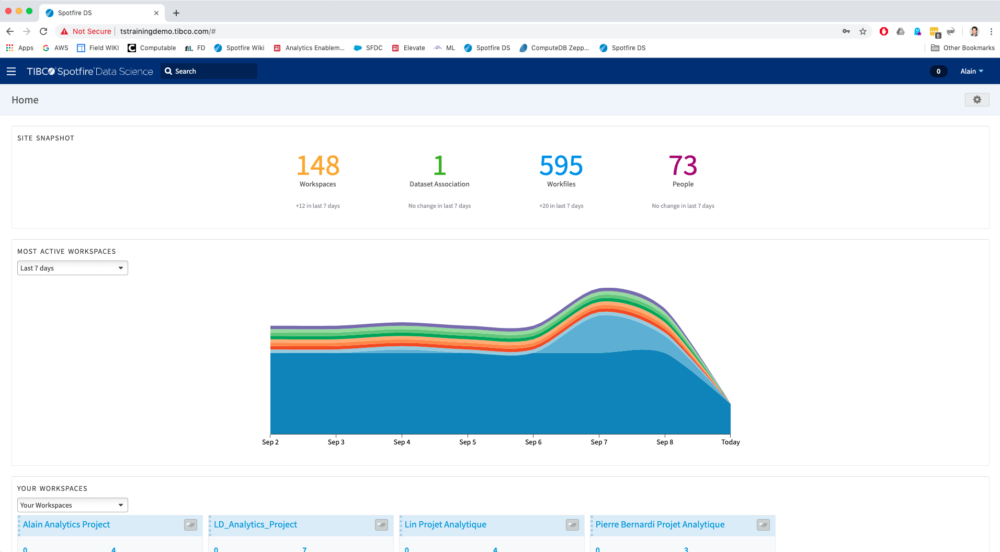

3. Click on your name (top right corner), navigate to Your Profile > Edit Your Profile, add a profile picture, and enter your title and department info. 

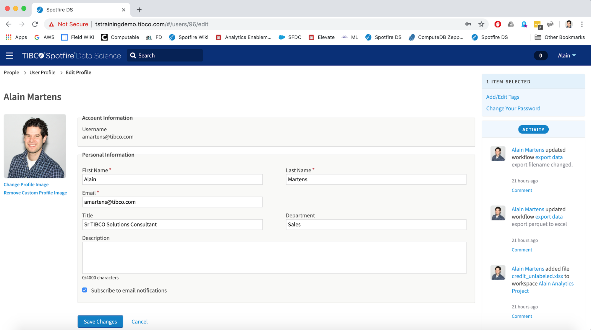

4. Create a non-public Workspace named [Your name] Analytics Project.

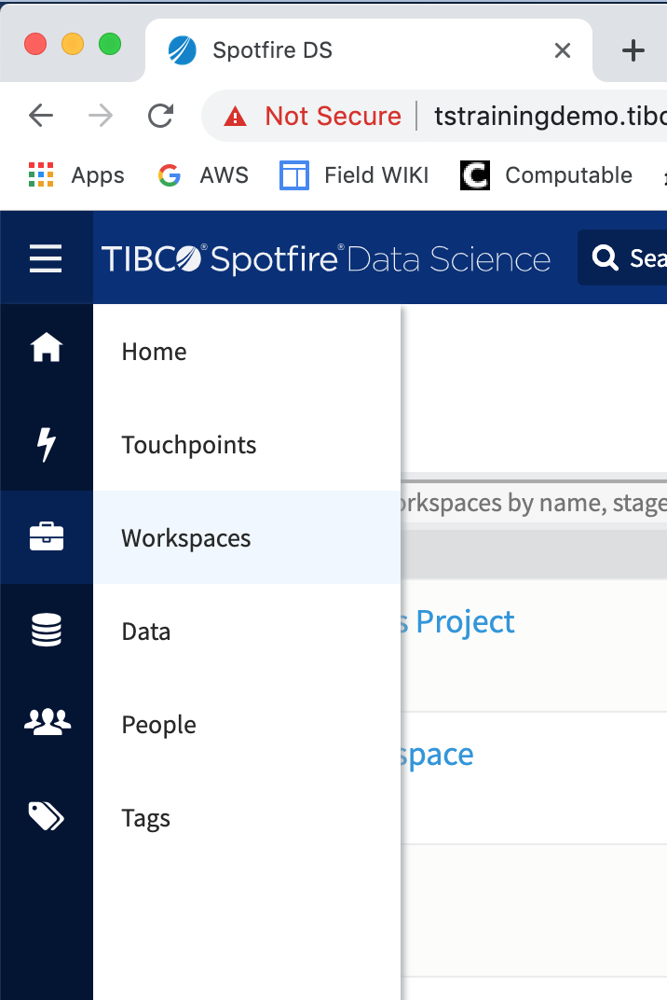

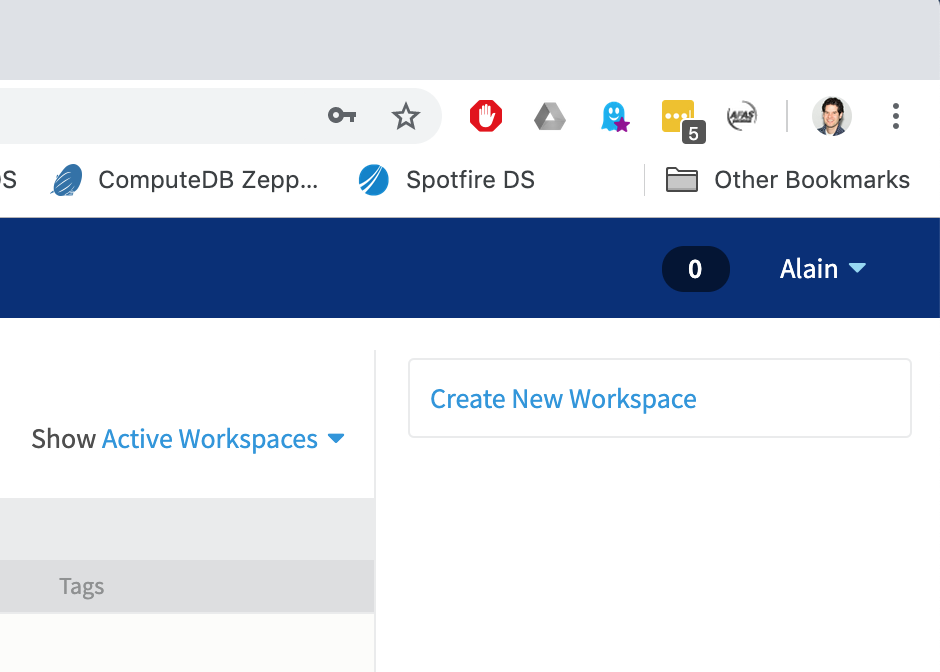

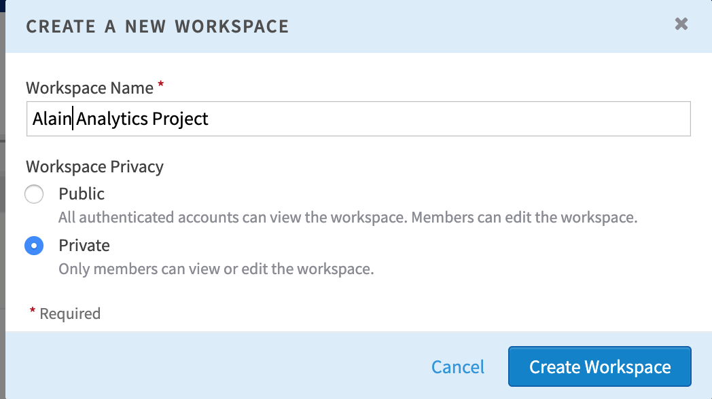

5. Add your fellow trainees as members of your workspace.			
6. Create four project milestones within your workspace with target dates today.
    1. Data Blending 
    2. Model Building
    3. Model Scoring
    4. Applying Model to new dataset

**[What happened]** \
At this moment you've performed the required steps to start your Data Science project. You've created a space for your project (a workspace), personalized your workspace, invited (several) team member with which you can collaborate and created several milestones with which you can indicate the current status of your data science project. At this point you're all set to create the data science workflow. 

2. Create a data science workflow
1. In your workspace, go to the work files tab and create a new workflow with Hadoop as data source. \
Name it ‘[Your initials] Credit Worthiness’.

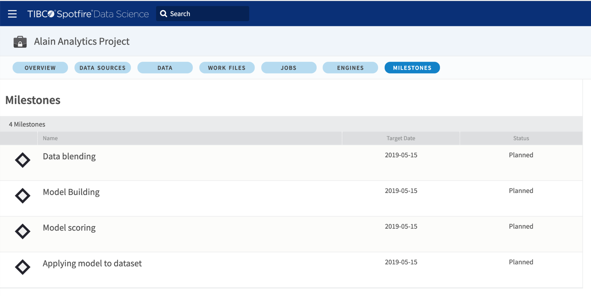

2. Open the workflow, go to the Data tab (on the left sidebar), click on Data Sources and navigate to <_Hadoop, TS_TrainingDemo, Alain_> and drag the folder 'credit_labeled' on the canvas.

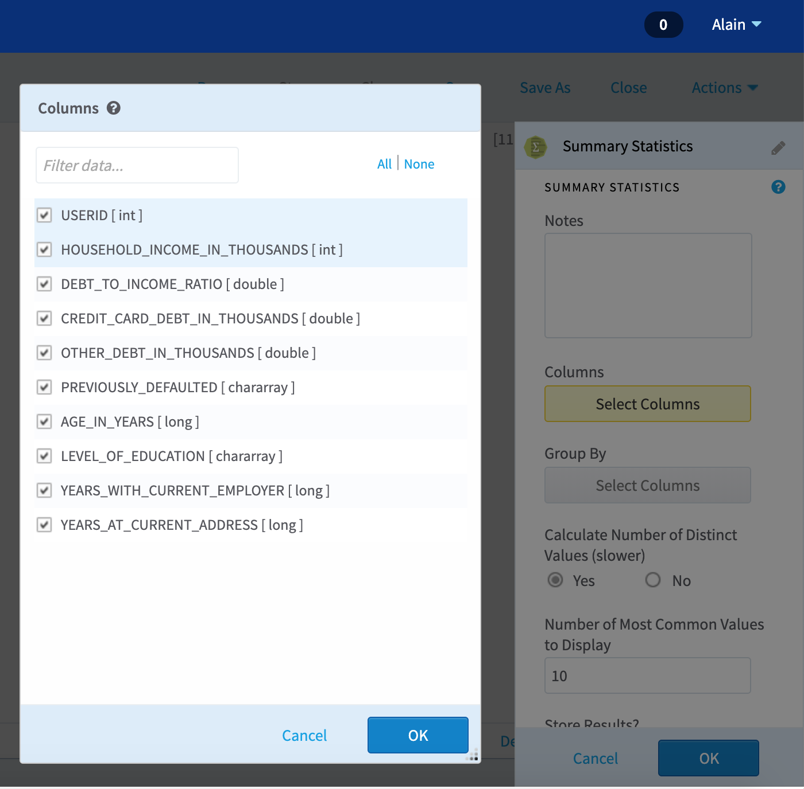

3. In the Operators tab (on the left sidebar) find the Summary Statistics operator and drag it on the canvas and connect it to the 'credit_labeled' node with the 'summary statistics' node.

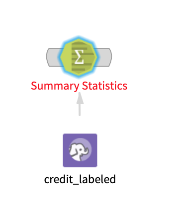

4. You will see that the title of the Summary Statistics is red which indicates that something still needs to be configured. To do so double click on the Summary Statistics node. On the right a menu appear with yellow colored buttons. The yellow colored buttons indicate that here some configuration is missing. 
5. Click on 'select columns' and click the checkmark for 'all' columns. Click ok to close. 

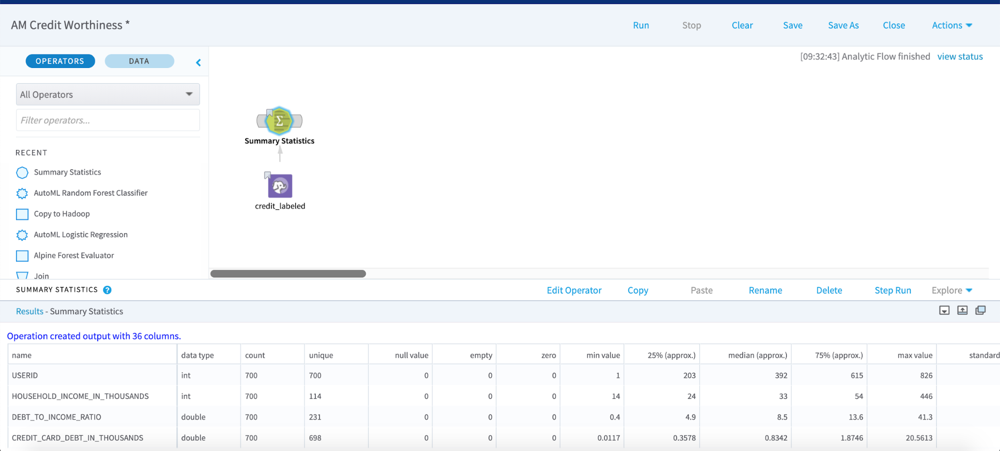

6. As a result the text 'Summary Statistics' should be black.
7. Next click 'Run' 
8. Once finished click on the Summary Statistics to inspect the result. 
9. Save your workfile and specify in the description; 'Summary statistics performed'.

**[What happened]** \
Some generic statistics are being gathered for the file that we've dragged onto the canvas.  \
This gives us important information to determine if our data is ready for use by our Machine Learning operators. Can you tell how many records are in the dataset? Does the USERID column contain unique values? Are there null values in the columns? What is the maximum value for HOUSEHOLD_INCOME_IN THOUSANDS?  \
Some common problems you can come across are that the data contains empty values, needs to be pivoted, joined, filtered etc. These actions can all be performed by TIBCO Data Science.  \
However from the summary statistics we can tell that the data is 'clean' and does not need to be prepared.  \
 \
Now we'll split the data into 2 groups, a training set (for model training) and a test set (for model validation).

10. On the operators tab search for 'random' and drag the 'Random Sampling' operator onto the canvas and connect it to the 'credit_labeled' node.

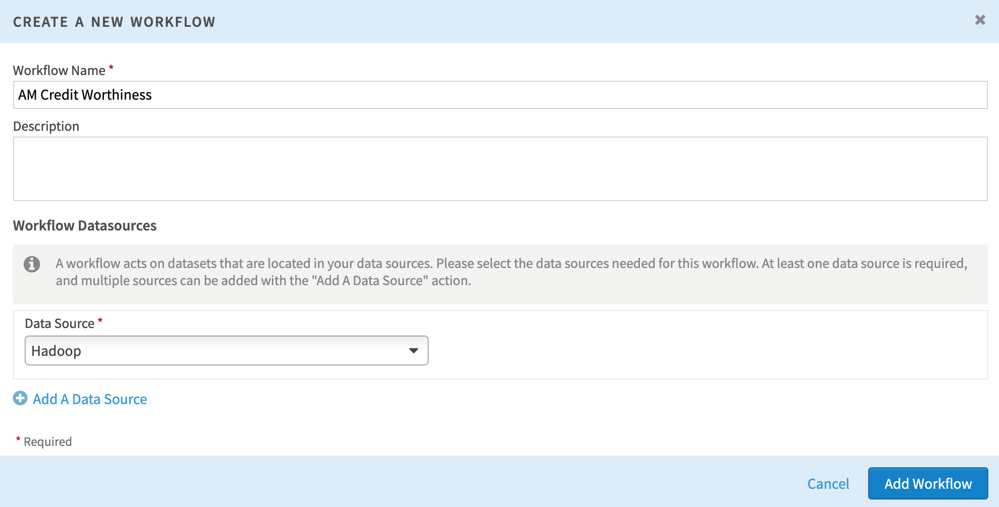

11. Open the 'Random Sampling' operator by double clicking it. Specify 2 for 'Number of Samples', Sample by 'Percentage' and 'Define Sample Sizes': 80% and 20%. Click ok to close
12. In the operators tab search for 'sample selector' and drag 2 'sample selector' nodes on the canvas. Connect both of them to 'Random Sampling' and rename 1 to 'Test Data' and the other one to 'Train Data'.  For the Train Data select the 80% sample size. For Test data select the 20% sample size. 
13. Save your workflow and describe; 'Random sampling added'.

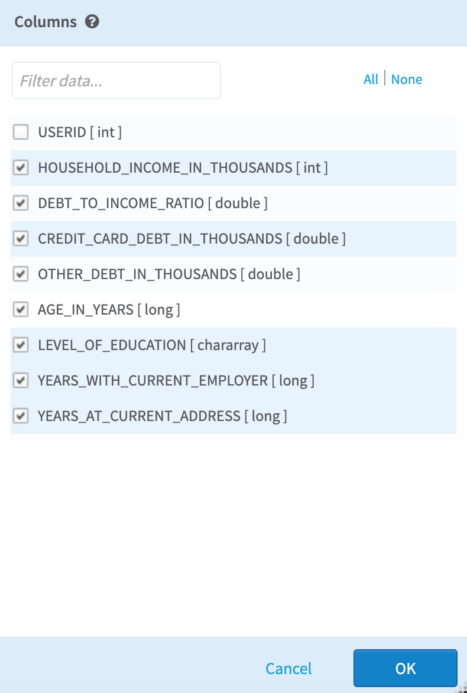

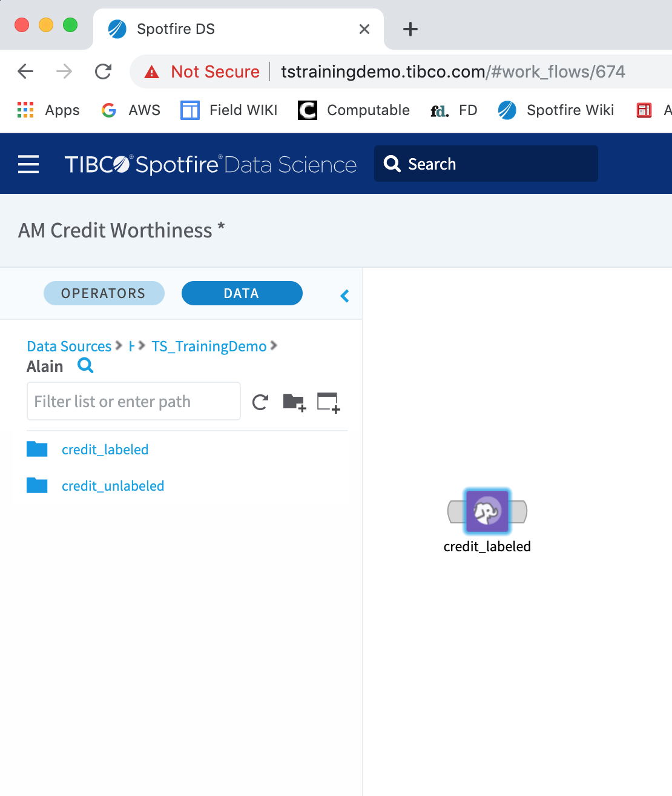

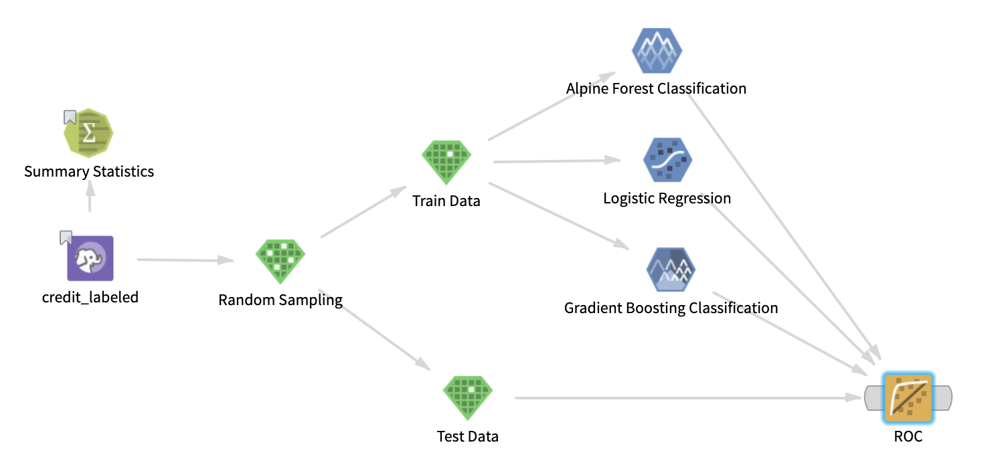

**[What happened]** \
At this point you've splitted the dataset into 2 groups with random data. A test set and a training set. The reason for doing so it that we'll use the Training Data set to train our ML models. We deliberately set apart some data (the Test Data set) which we will not use to train our model. Since we do know if we grant a loan to the applicants in the test data set we can validate our model results with the 'answers' in our test data set. 

Now let's introduce various ML operators to find our best predictive model.

14. On the operators tab select the drop down list with 'Model' operators and drag the following operators on the canvas:
    1. Alpine Forest Classification
    2. Logistic Regression
    3. Gradient Boosting Classification
15. Link the operators to the 'Train Data' node and configure the model nodes with 'Dependent Column': PREVIOUSLY_DEFAULTED and 'Select Columns' all but USER_ID.

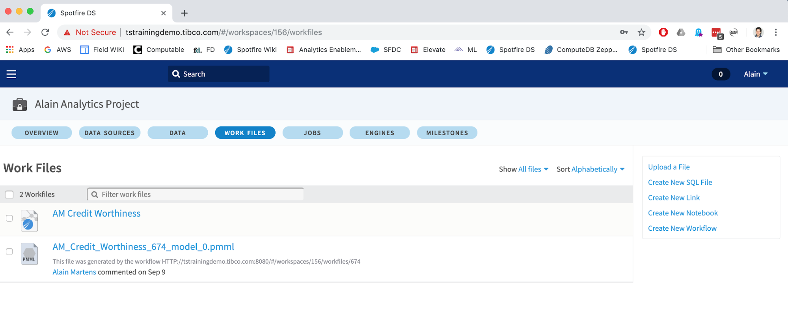

16. This should result in the following flow: 

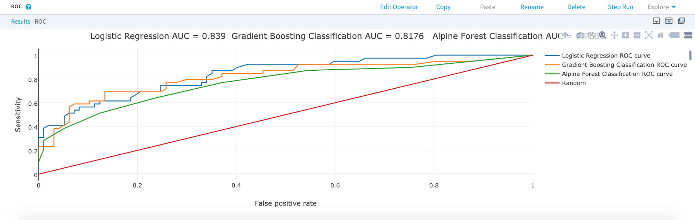

17. Next search for 'ROC' in the operators tab, select the ROC operator to the canvas and connect the following nodes to the ROC operator. 
    4. Alpine Forest Classification
    5. Logistic Regression
    6. Gradient Boosting Classification 
    7. Test Data
18. As configuration of the ROC node specify: Yes 

19. You should now have the following flow: 

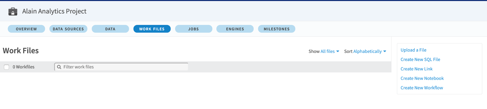

20. Save your flow and specify that you've introduced model operators.
21. Run your flow and wait for it to complete its execution.

**[What happened]** \
In your flow you've modelled 3 Machine Learning operators. Each of the ML operators have been configured to predict the value for 'PREVIOUSLY_DEFAULTED' based on all other parameters (columns) in the data except USER_ID. Each ML operator uses a different algorithm to arrive at a predictive model. In order to assess which model is best you've introduced the ROC operator. On the ROC curve you've specified to predict 'Yes' which means that we predict if someone would default on their loan. ROC stands for Receiving Operator Characteristics curve which is tool that can help evaluate the model quality. Based on its output we can decide our winning model.

3. Review model performance

When your flow finished executing we can assess the model quality by clicking on the ROC node.

After doing so you should see the following graph in the results section:

The blue, orange and green lines in this graph represent the result of one of the models. The red line indicates randomly selecting if a loan should be granted or not (based on chance instead of a statistical model). In the ROC curve the best predictive model would draw a line from points 0,0 to 1,0 (straight up from the origin) and from 1,0 to 1,1. So like this: 

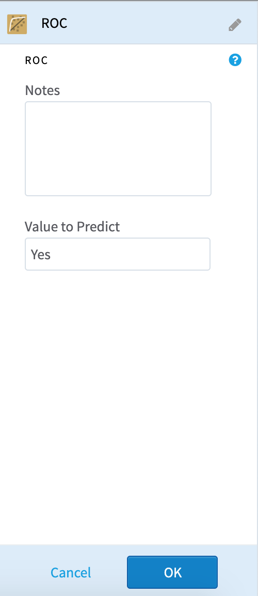

    This means that the model which closest represents this shape is the best model. 

To assess the quality based on metrics we can use the AUC metric. This stands for Area Under the Curve which is a metric between 0 and 1. The AUC values for our models listed in the title of our ROC curves. In our case, which model performed the best?

**[What happened]** \
We have trained 3 models and ran the models against the unseen transactions in the 'Test Data' set. The results for correctly predicted results have been plotted in the ROC curve. Based on the results in the ROC curve and using the AUC metric you could have concluded that the Logistic Regression model is the best performing model. 

4. Export model for Real Time scoring
1. We now have a predictive model that we can use to score 'new' loan requests which will help the company to decide if it should grant a loan (or not). We can use the model to score 'batches' of loan requests at once  in TIBCO Data Science or we can score new loan requests in real time using TIBCO Data Streams (which we've seen in the demo).
2. In either case we can export the model from TIBCO Data Science to a portable format for use in either tool. In this case we'll export the model to a PMML file. This stands for Predictive Model Markup Language and it's a industry standard for model sharing. A PMML file contains a model which can be used for (realtime) scoring and can be used in TIBCO Spotfire Data Streams.
3. In your workflow search for the 'export' operator, drag it onto the canvas and connect it to our winning model. As configuration select to export the model to the PMML format. 
4. Save and Run your workfile.

5. If you close your workfile you should find a new file in your workspace which is the exported PMML file. 

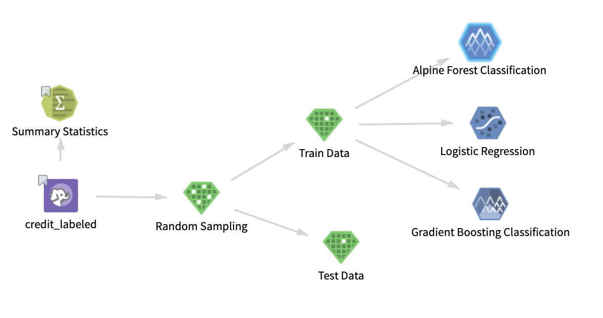

6. Congratulations, you've now successfully completed all Labs!

**[What happened]**
Let's recap what we've done.
1. First you've prepared your project environment (workspace) for this data science project
2. Next we've loaded our data from Hadoop.
3. After that we've explored if data preparation needs to be performed.
4. Next we've split that data in a training and test set and scored 3 different models against the training set.
5. Then we've validated the model performance using the test data set.
6. And at last we've exported the winning model to automatically score new loan requests (in batches using TIBCO Data Science or in real time using TIBCO Data Streams)
